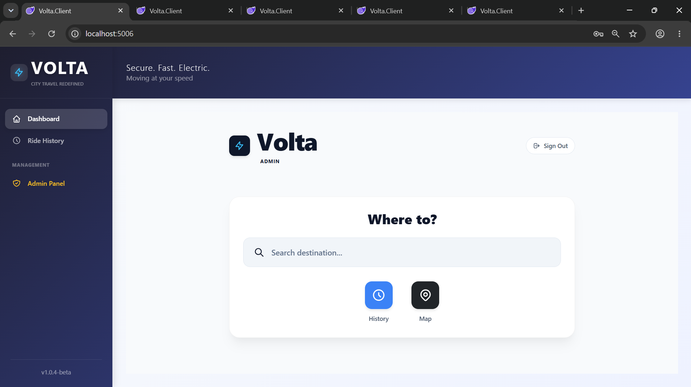
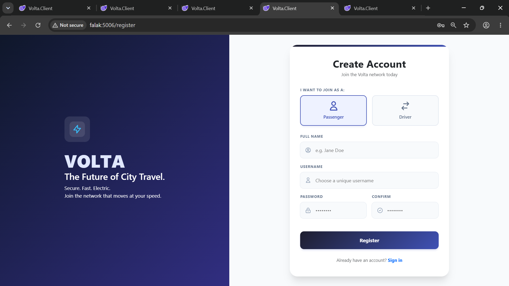
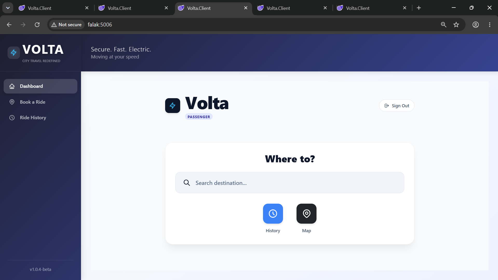
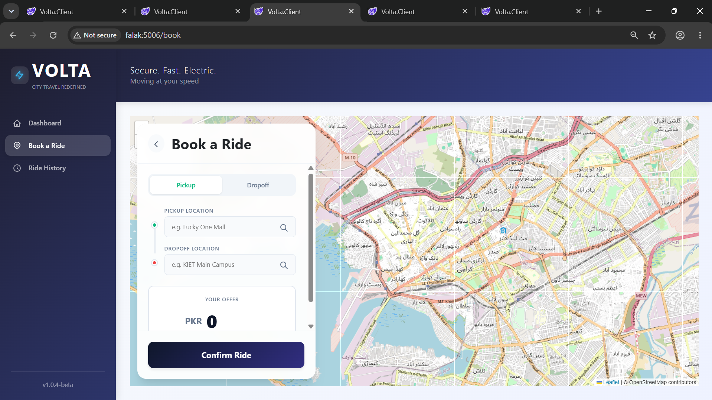
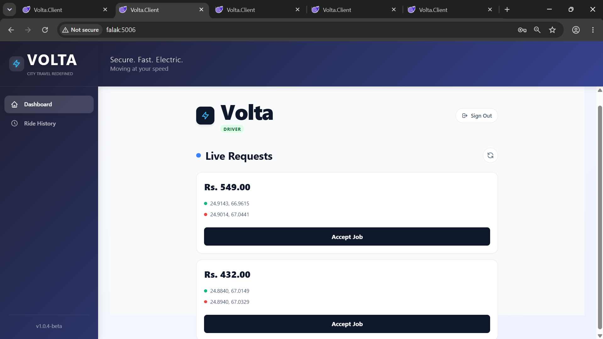
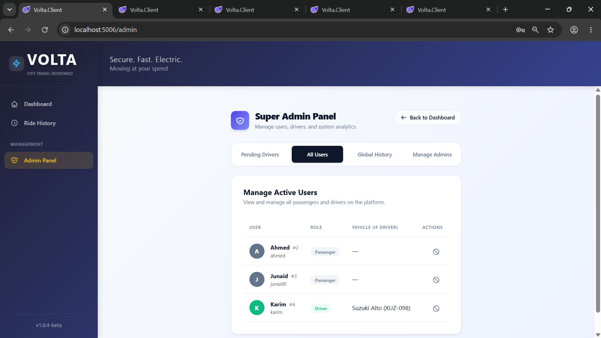
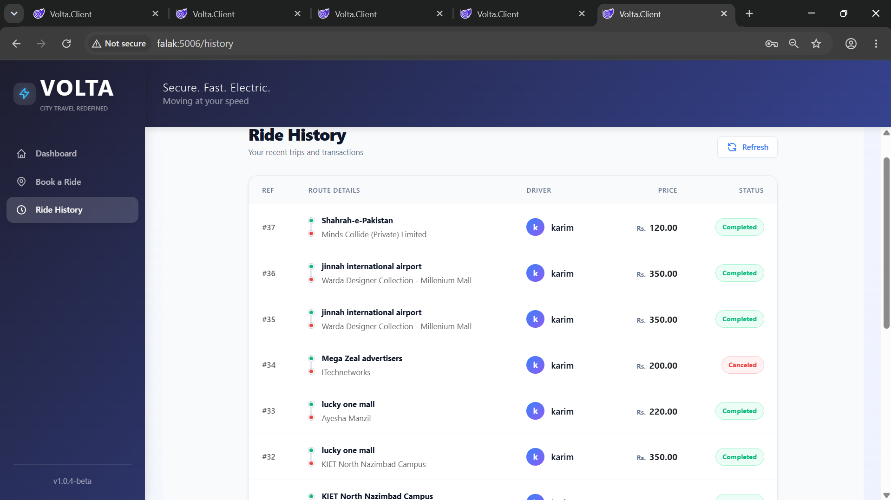

# 🚖 Volta – Distributed Ride Booking Platform

An end-to-end **distributed ride booking platform** built using **.NET 10 Microservices Architecture**. Volta demonstrates modern backend engineering concepts including **API Gateway routing, event-driven communication, service isolation, JWT authentication, real-time messaging, and database-per-service architecture**.

The project was developed to simulate how modern ride-hailing platforms manage communication between multiple independent services while providing a seamless real-time experience for passengers, drivers, and administrators.

---

## 🚀 Features

### 🚖 Ride Booking

- Book rides using an interactive map interface.
- Select pickup and destination locations.
- Automatic route distance calculation using OSRM.
- Passenger-defined custom fare (InDrive-style ride offers).
- Complete ride lifecycle management.

---

### 🚗 Driver Portal

- Receive ride requests instantly.
- Accept incoming ride requests in real time.
- View assigned rides.
- Complete active trips.
- Maintain ride history.

---

### 👤 Authentication & Authorization

- Secure user registration and login.
- JWT-based authentication.
- SHA-256 password hashing.
- Role-Based Authorization.
- Separate access levels for:

  - Passenger
  - Driver
  - Admin

---

### 📡 Real-Time Communication

Powered by **SignalR**, allowing:

- Live ride requests.
- Instant ride acceptance.
- Ride status synchronization.
- Trip completion updates.
- Automatic UI refresh without page reloads.

---

### 📨 Event-Driven Architecture

Uses **RabbitMQ + MassTransit** for asynchronous communication between services.

Benefits include:

- Loose coupling
- Independent service communication
- Better scalability
- Reliable message delivery

---

### 🗺 Interactive Maps

- LeafletJS integration
- OpenStreetMap tiles
- OSRM route calculation
- Real-time distance estimation

---

### 👨‍💼 Admin Dashboard

Administrators can:

- View complete ride history
- Approve new drivers
- Manage passengers
- Manage drivers
- Manage administrators
- Monitor overall system activity

---

# 🏗️ System Architecture

```text
                         Blazor WebAssembly
                               │
                               ▼
                    Ocelot API Gateway
                               │
        ┌──────────────┬──────────────┬──────────────┐
        ▼              ▼              ▼
  Auth Service     Ride Service    Driver Service
        │              │              │
        │              │              │
        ▼              ▼              ▼
  Auth Database   Ride Database   Driver Database
                       │
                       ▼
             RabbitMQ + MassTransit
                       │
                       ▼
                 Driver Service
                       │
                       ▼
                    SignalR Hub
                       │
             ┌─────────┴─────────┐
             ▼                   ▼
        Passenger UI         Driver UI
```

The **Ocelot API Gateway** acts as the single entry point for all client requests. Each microservice owns its own database, ensuring loose coupling and service independence. Services communicate asynchronously using RabbitMQ, while SignalR delivers live updates to connected users.

---

# 🔄 Microservices

## 🚪 API Gateway

Acts as the central entry point for all incoming requests.

Responsibilities include:

- Request routing
- Service abstraction
- Reverse proxy
- Centralized API access

---

## 🔐 Authentication Service

Responsible for:

- User registration
- User login
- JWT generation
- SHA-256 password hashing
- User roles
- Authentication validation

---

## 🚖 Ride Service

Handles all ride-related operations.

Responsibilities include:

- Ride booking
- Distance calculation
- Route generation
- Ride history
- Fare management
- Publishing ride events
- SignalR notifications

---

## 🚗 Driver Service

Responsible for driver operations.

Functions include:

- Receiving ride events
- Accepting ride requests
- Managing active trips
- Completing rides
- Driver ride history

---

## 📦 Shared Contracts

A shared library containing:

- Event models
- Message contracts
- Shared DTOs
- Communication interfaces

This ensures consistent communication between all microservices.

---

# 📡 Event-Driven Communication

Volta follows an **event-driven architecture** where services communicate asynchronously through RabbitMQ.

```text
Passenger Creates Ride
          │
          ▼
     Ride Service
          │
 Publish RideCreated Event
          │
          ▼
 RabbitMQ + MassTransit
          │
          ▼
    Driver Service
          │
 Driver Accepts Ride
          │
          ▼
 Ride Status Updated
          │
          ▼
 SignalR Notification
          │
          ▼
 Passenger & Driver UI
```

This approach keeps services independent while enabling reliable communication across the system.

---

# 🚖 Ride Booking Workflow

```text
Passenger Login
      │
      ▼
Select Pickup & Destination
      │
      ▼
OSRM Calculates Distance
      │
      ▼
Passenger Sets Custom Fare
      │
      ▼
Ride Service Stores Booking
      │
      ▼
RabbitMQ Publishes Ride Event
      │
      ▼
Driver Service Receives Request
      │
      ▼
Driver Accepts Ride
      │
      ▼
SignalR Updates Passenger
      │
      ▼
Ride Starts
      │
      ▼
Driver Completes Trip
      │
      ▼
Ride History Updated
```

---

# 👨‍💼 Admin Workflow

The administration panel provides centralized management for the entire platform.

Administrators can:

- Monitor all completed rides
- View cancelled rides
- Review ride history
- Approve pending driver registrations
- Manage platform users
- Manage administrator accounts
- Monitor overall system activity

---

# 💻 Tech Stack

## Frontend

- Blazor WebAssembly
- HTML
- CSS
- JavaScript
- LeafletJS
- OpenStreetMap

---

## Backend

- ASP.NET Core Web API (.NET 10)
- Ocelot API Gateway
- Entity Framework Core
- REST APIs
- SignalR

---

## Messaging

- RabbitMQ
- MassTransit

---

## Security

- JWT Authentication
- SHA-256 Password Hashing
- Role-Based Authorization

---

## Database

- Microsoft SQL Server

Architecture Pattern:

- Database per Service

Each microservice maintains its own independent database.

---

## Routing & Maps

- LeafletJS
- OSRM Routing API

---

## Version Control

- Git
- GitHub

---

# 📂 Project Structure

```text
Volta/
│
├── Volta.Client/
│   ├── Blazor WebAssembly Frontend
│
├── Volta.Gateway/
│   ├── Ocelot API Gateway
│
├── Volta.Services.Auth/
│   ├── Authentication Service
│   ├── JWT Authentication
│   ├── User Management
│
├── Volta.Services.Ride/
│   ├── Ride Booking Service
│   ├── SignalR Hub
│   ├── Route Calculation
│
├── Volta.Services.Driver/
│   ├── Driver Service
│   ├── Ride Acceptance
│   ├── Driver Operations
│
└── Volta.Contracts/
    ├── Shared Events
    ├── Shared DTOs
    └── Communication Contracts
```

---

# 🔄 Application Workflow

1. Passenger logs into the platform.
2. The client communicates with the Ocelot API Gateway.
3. The Gateway forwards requests to the appropriate microservice.
4. Ride Service calculates the route using OSRM.
5. Ride details are stored in the Ride Database.
6. Ride Service publishes a `RideCreated` event through RabbitMQ.
7. Driver Service consumes the event.
8. Available drivers receive the request instantly.
9. Driver accepts the ride.
10. SignalR pushes live updates to the passenger.
11. Ride status changes throughout the trip.
12. Upon completion, ride history is synchronized for both users.

---
# 📷 Screenshots

> Replace the placeholders below with your actual screenshots.

### 🏠 Home Page



---

### 🔐 Login Page



---

### 🚖 Passenger Dashboard



---

### 🗺 Ride Booking



---

### 🚗 Driver Dashboard



---

### 👨‍💼 Admin Dashboard



---

### 📜 Ride History



---

# ⚙️ Installation

## Clone Repository

```bash
git clone https://github.com/falakshah-21/Volta-Distributed-Ride-System.git
```

---

## Prerequisites

Before running the project, ensure the following are installed:

- .NET 10 SDK
- SQL Server
- RabbitMQ
- Visual Studio 2022 / Visual Studio Code

---

## Configure Databases

Update the **connection strings** inside each microservice.

- Auth Service
- Ride Service
- Driver Service

Apply Entity Framework migrations (if required).

```bash
dotnet ef database update
```

Run the above command inside each service project.

---

## Start RabbitMQ

Ensure RabbitMQ is running before starting the services.

Default RabbitMQ endpoint:

```
localhost:5672
```

---

## Run API Gateway

```bash
cd Volta.Gateway

dotnet restore

dotnet run
```

---

## Run Authentication Service

```bash
cd Volta.Services.Auth

dotnet restore

dotnet run
```

---

## Run Ride Service

```bash
cd Volta.Services.Ride

dotnet restore

dotnet run
```

---

## Run Driver Service

```bash
cd Volta.Services.Driver

dotnet restore

dotnet run
```

---

## Run Client

```bash
cd Volta.Client

dotnet restore

dotnet run
```

---

# 🧪 Demo Scenarios

### Passenger

- Register/Login
- Select pickup location
- Select destination
- Set custom fare
- Book ride
- Track ride status
- View ride history

---

### Driver

- Login
- Receive ride requests
- Accept incoming ride
- Complete trip
- View completed rides

---

### Administrator

- Login
- View platform-wide ride history
- Approve pending drivers
- Manage users
- Manage administrators

---

# 📈 Future Improvements

The project is functionally complete and demonstrates a working distributed architecture.

Possible future enhancements include:

- Next.js frontend migration
- Docker & Docker Compose support
- Kubernetes deployment
- Redis caching
- Distributed logging
- OpenTelemetry tracing
- Prometheus & Grafana monitoring
- CI/CD with GitHub Actions
- Push notifications
- Driver location tracking
- Payment gateway integration
- Ride cancellation policies
- Surge pricing
- Multi-language support

---

# 🎯 Learning Outcomes

This project provided hands-on experience with:

- Microservices Architecture
- Distributed System Design
- API Gateway Pattern
- Event-Driven Communication
- RabbitMQ Messaging
- Service Isolation
- Database-per-Service Architecture
- JWT Authentication
- Role-Based Authorization
- SignalR Real-Time Communication
- Entity Framework Core
- REST API Development
- Scalable Backend Design

---

# 🤝 Team

This project was collaboratively developed by:

### **Falak Shah**

- Microservices Architecture
- API Gateway
- Authentication & Authorization
- JWT Implementation
- Backend Integration

---

### **Junaid Zia**

- Database Design
- Entity Framework Core
- Ride Management Logic
- Data Persistence
- SignalR Integration

---

### **Abdul Karim Hasan**

- Blazor WebAssembly Frontend
- User Interface
- Map Integration
- User Experience
- RabbitMQ Integration

---

# 📄 License

This project was developed for educational and portfolio purposes.

---

# 👨‍💻 Authors

- **Falak Shah**
- **Junaid Zia**
- **Abdul Karim Hasan**

---

## ⭐ Support

If you found this project interesting, consider giving it a **Star ⭐** on GitHub.

Feedback, suggestions, and contributions are always welcome!

---

> *Volta demonstrates how modern distributed applications can leverage microservices, asynchronous messaging, and real-time communication to build scalable, maintainable, and responsive systems.*
